# Project journal and notes
## Current state of plugin

- On branch [mitsuba_version_update](https://github.com/mitsuba-renderer/mitsuba-blender/pull/137)
- Works with mitsuba 3.7 
- Internal rendering: not working at all (in blender lts 3 it raises unhandled error by invocating deprecated functions, in blender lts 4 the mitsubaRenderEngine class is simply incorect, was made for blender 3)
- Import: meshes seems to be correctly imported but materials are lost when trying to use mitsuba as render engine. Other engine keep some material but not all => requires more testing
- Export: meshes seems to be correctly exported to mitsuba, however light and material might not. Further testing is required.

### Export tests 
Blender scenes rendered with cycles using 64 samples and 5 bounces 
| shader node | export to mitsuba works | visually similar | Blender (Cycle) | Mitsuba |
|-|-|-|-|-|
| Diffuse + point light | yes | yes | 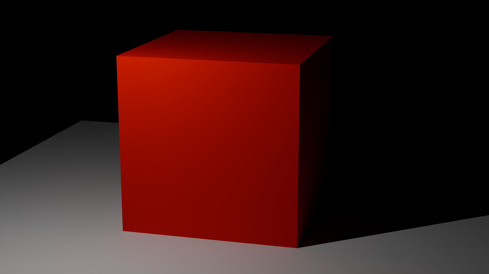 | 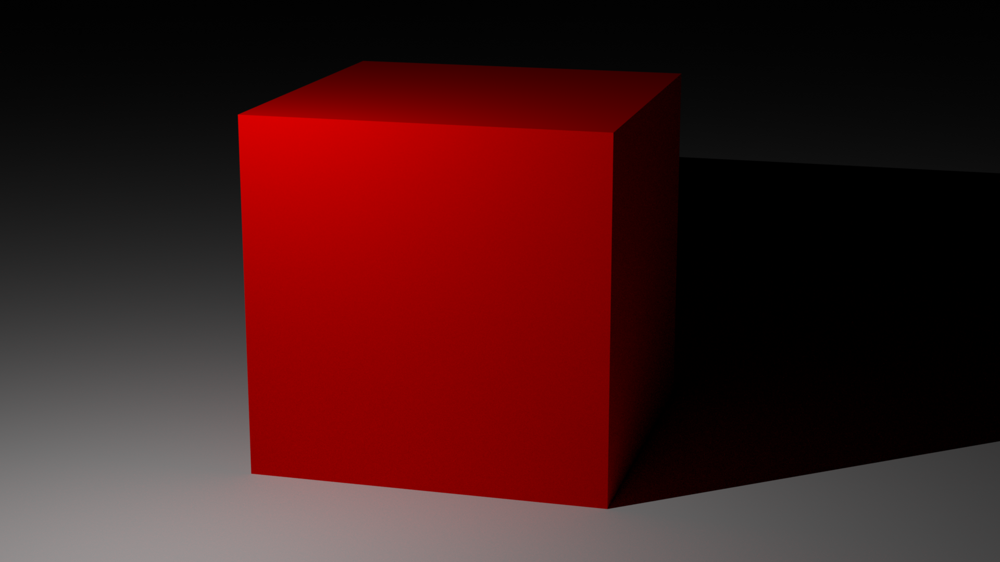 |
| diffuse + sun | yes | no |  | 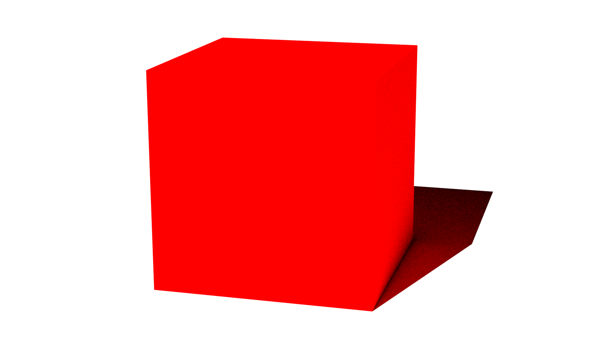 |
| diffuse + spot | yes | yes | 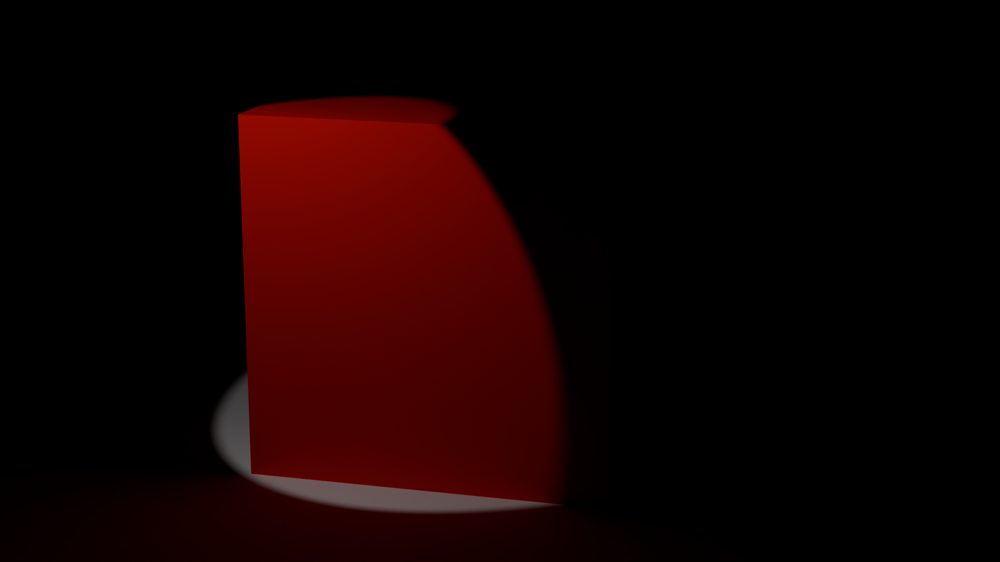 | 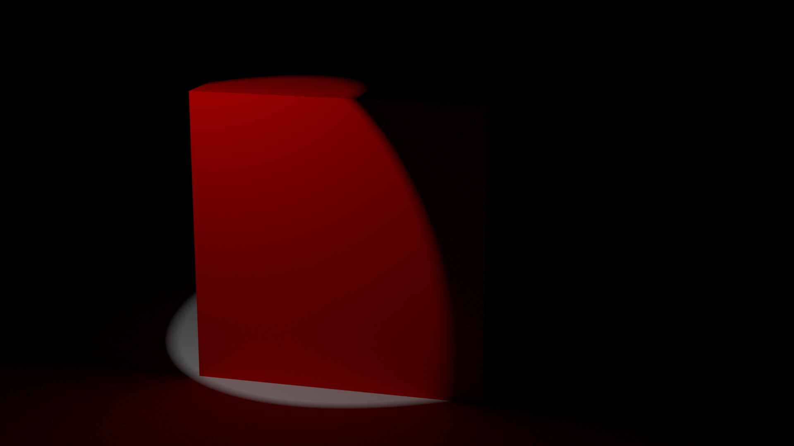 |
| diffuse + area | yes | yes but light visible in mi |  | 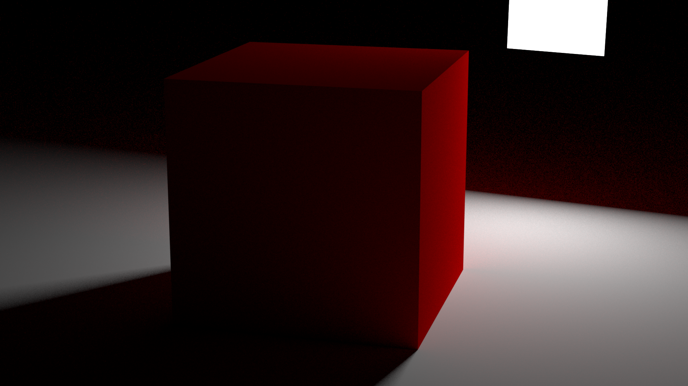 |
| Emission + metallic bsdf | yes | slight differences |  | 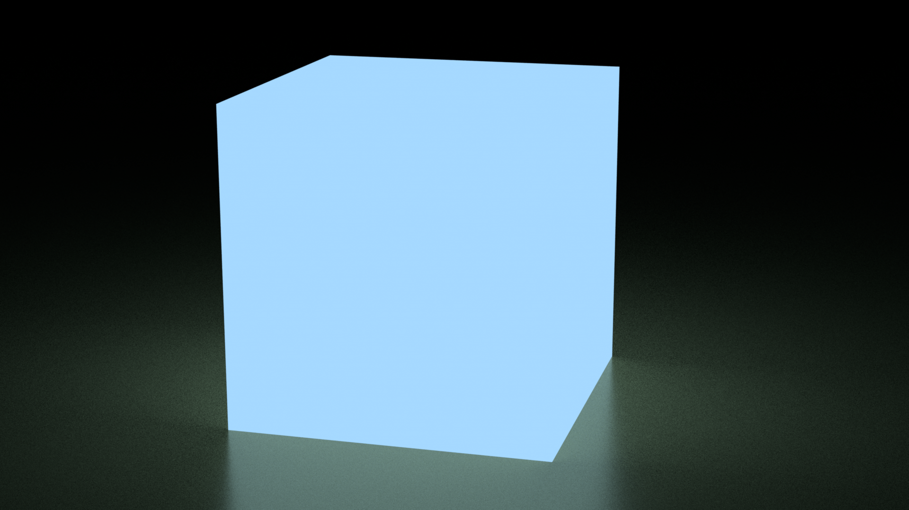 |
| Glass + sun light + diffuse plane | yes | no |  | 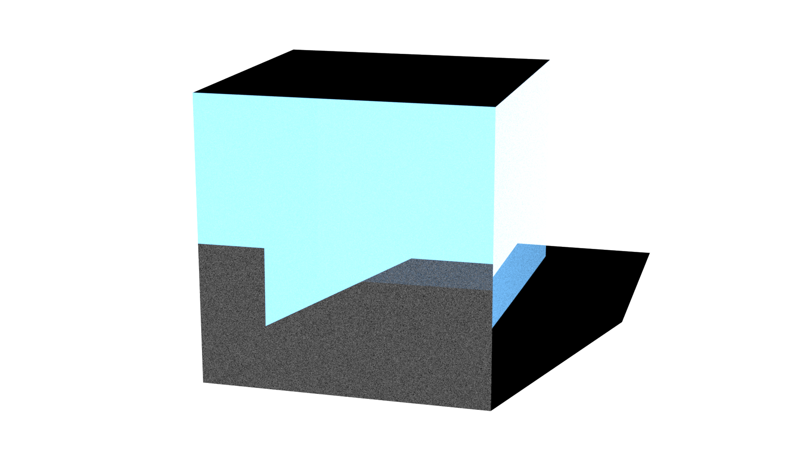 |
| Glossy | yes | slight differences | 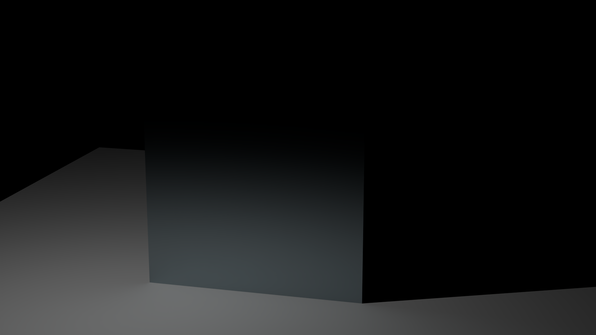 | 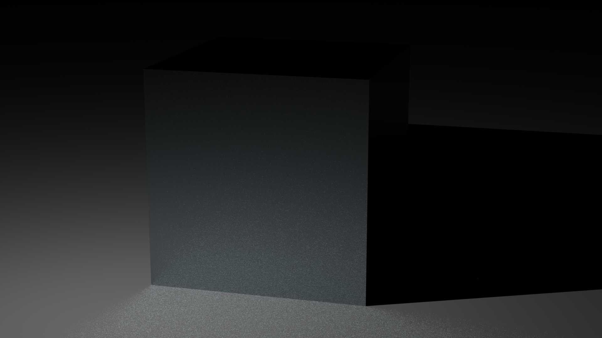 |
| Metallic | no | - | 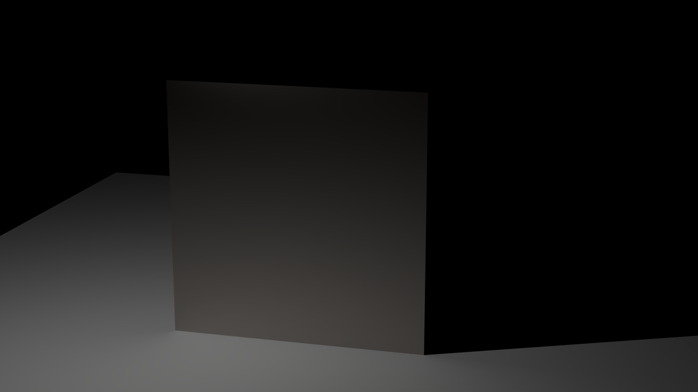 | 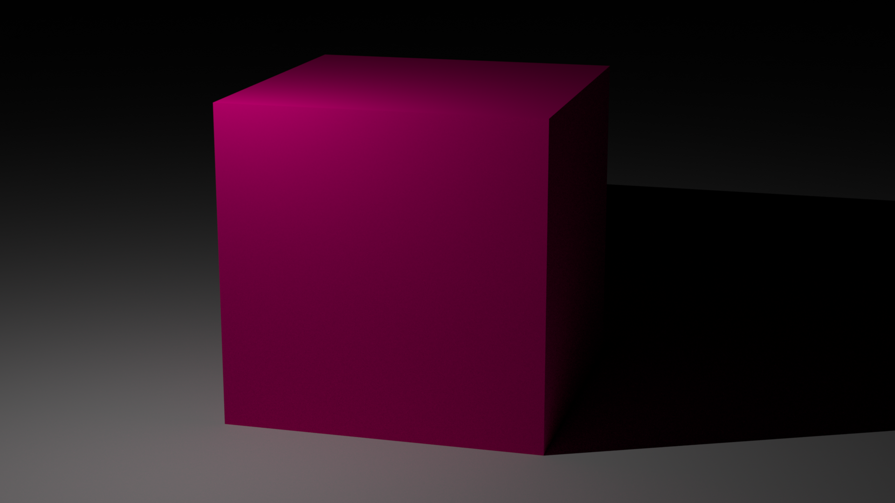 |
| Mix | no | - |  |  |
| Principled | no | - | 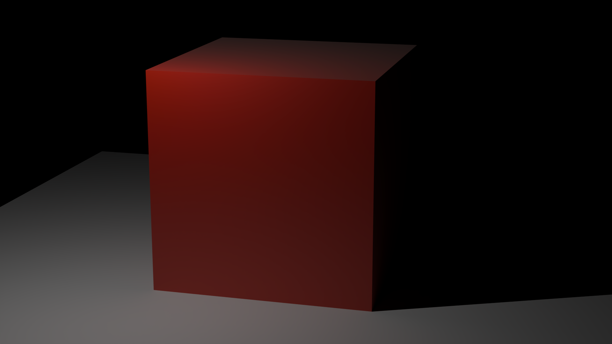 |  |
| Ray portal | no | - | 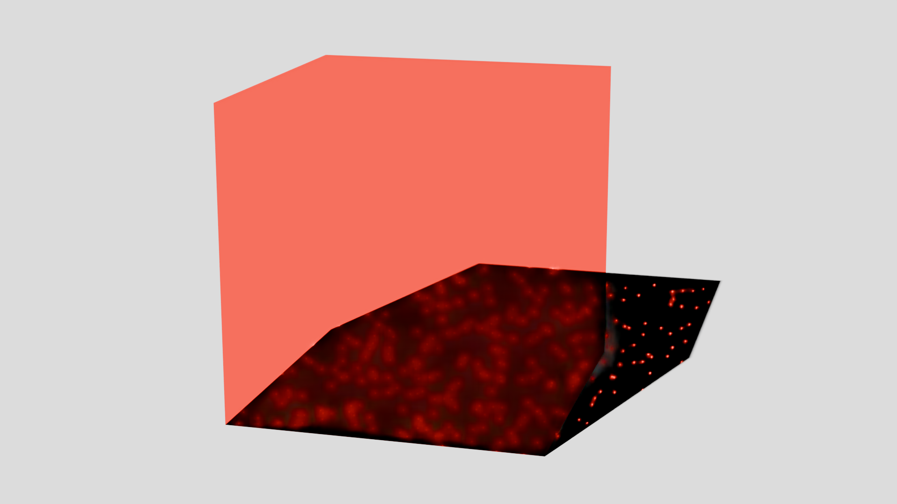 | 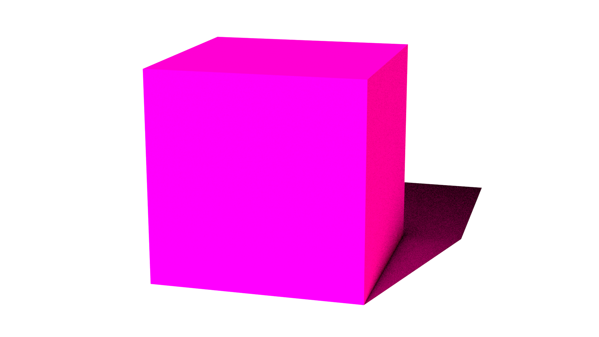 |
| Refraction | no | - |  |  |
| Sub surface scattering | no | - |  |  |
| Toon | no | - |  | 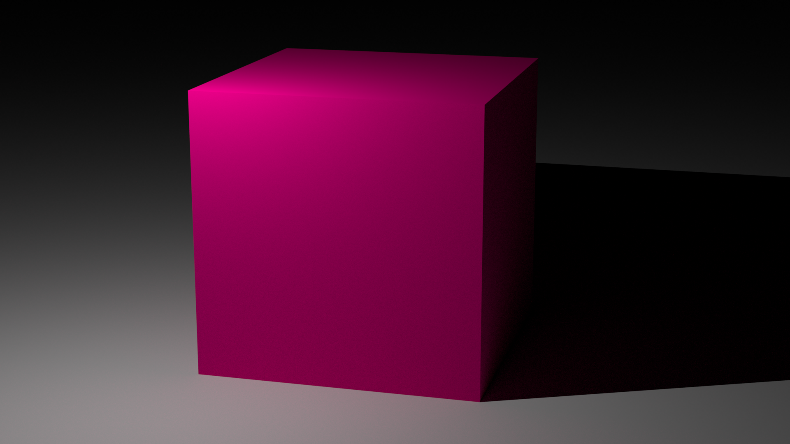 |
| translucent | no | - |  |  |
| Transparent | yes | no | 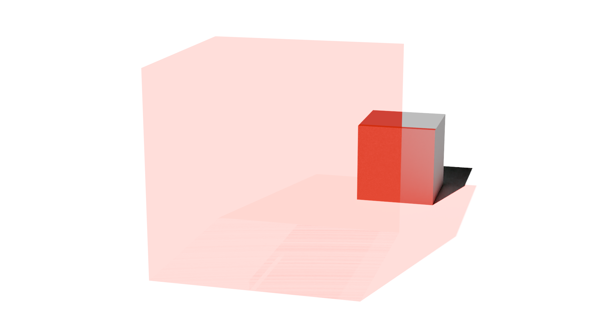 | 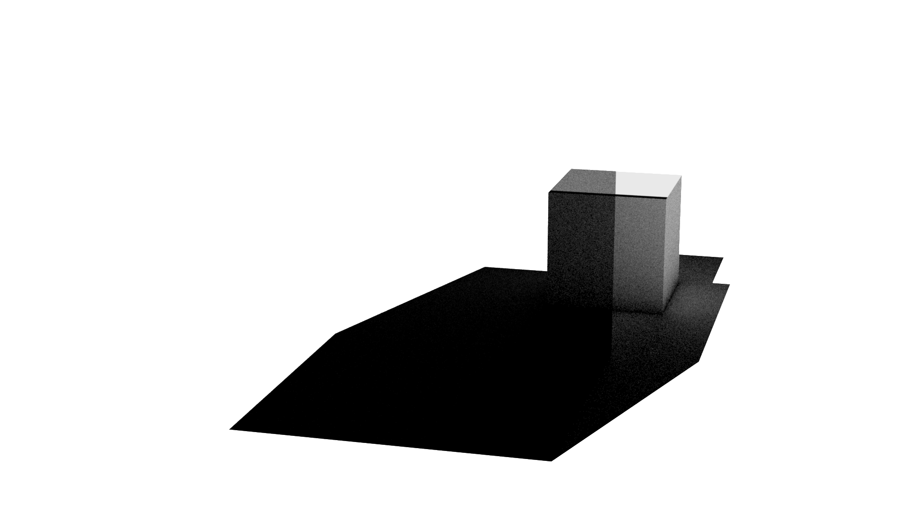 |
| Volume scatter | no | - |  |  |

- Bug encountered when exporting volume scatter 
- Bug encountered when mitsuba tried rendering principled 