# Project journal and notes
## Current state of plugin

- On branch [mitsuba_version_update](https://github.com/mitsuba-renderer/mitsuba-blender/pull/137)
- Works with mitsuba 3.7 
- Internal rendering: not working at all (in blender lts 3 it raises unhandled error by invocating deprecated functions, in blender lts 4 the mitsubaRenderEngine class is simply incorect, was made for blender 3)
- Import: meshes seems to be correctly imported but materials are lost when trying to use mitsuba as render engine. Other engine keep some material but not all => requires more testing
- Export: meshes seems to be correctly exported to mitsuba, however light and material might not. Further testing is required.

### Export tests 
Blender scenes rendered with cycles using 64 samples and 5 bounces 

| shader node | expected to work based on [wiki](https://github.com/mitsuba-renderer/mitsuba-blender/wiki/Exporting-a-Blender-scene) | export to mitsuba works | visually similar | Blender (Cycle) | Mitsuba |
|-|-|-|-|-|-|
| Diffuse + point light | yes | yes | yes |  |  |
| diffuse + sun | yes | yes | no |  |  |
| diffuse + spot | yes |yes | yes |  |  |
| diffuse + area | yes | yes | yes but light visible in mi |  |  |
| diffuse + area rectangle | yes | yes | yes but light visible in mi |  | 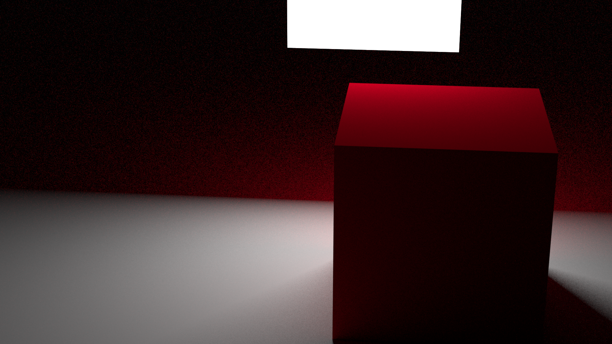 |
| diffuse + area disk | yes | yes | yes but light visible in mi |  | 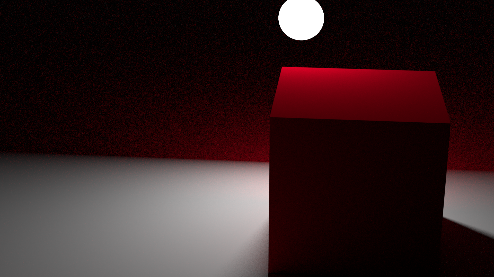 |
| diffuse + area ellipse | no | no | - |  |  |
| Emission + metallic bsdf | yes | yes | slight differences |  |  |
| Glass + sun light + diffuse plane | yes | yes | no |  |  |
| Glossy | yes | yes | slight differences |  |  |
| Metallic | no |no | - |  |  |
| Mix (diffuse + diffuse) | yes | no | - | 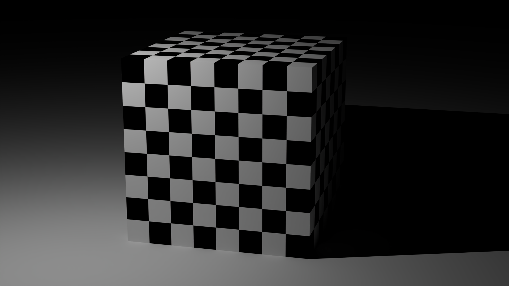 | 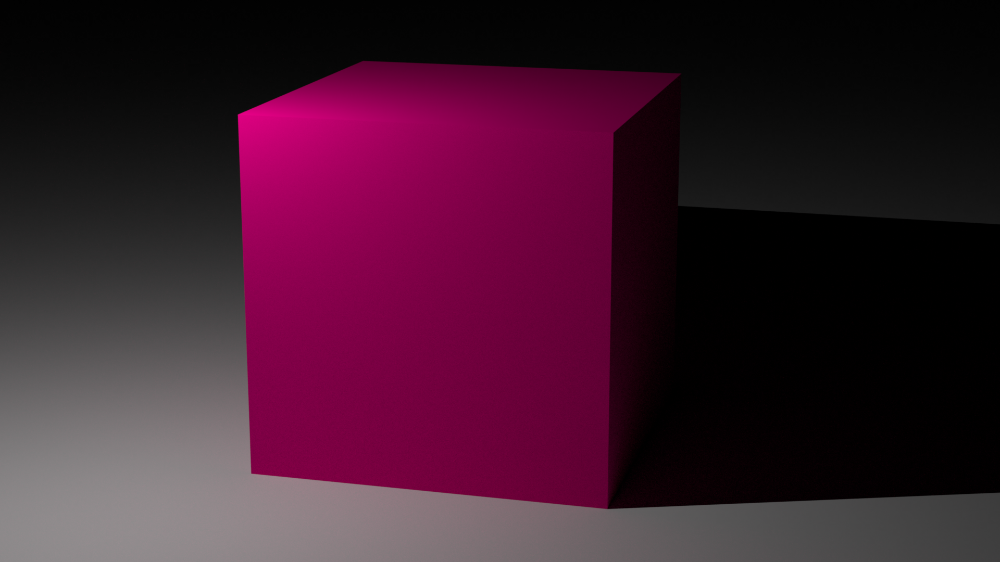 |
| Mix (diffuse + glass) | yes | no | - |  |  |
| Principled | yes | no | - |  |  |
| Ray portal | no | no | - |  |  |
| Refraction | no | no | - |  |  |
| Sub surface scattering | no | no | - |  |  |
| Toon | no | no | - |  |  |
| translucent | no | no | - |  |  |
| Transparent | no | yes | no |  |  |
| Volume scatter | no | no | - |  |  |
| Metaball | yes | not really | artefact creation |  | 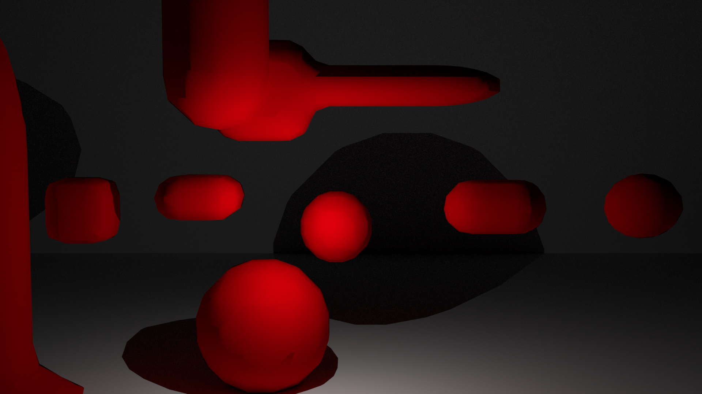 |
| Text | yes | no | duplicate text | 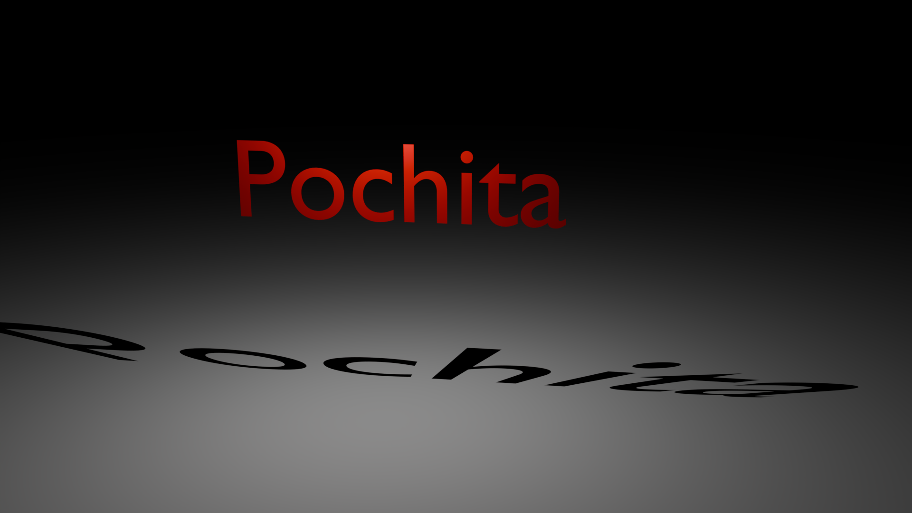 | 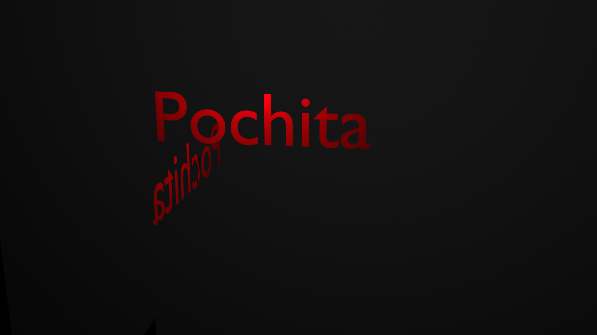 |
| Nurbs surface | yes | no | duplicate surface |  | 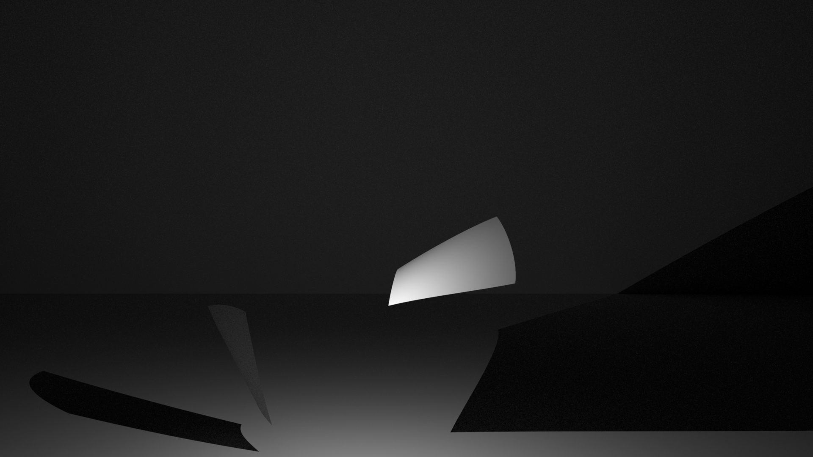 |
| Image texture | yes | yes | yes |  | 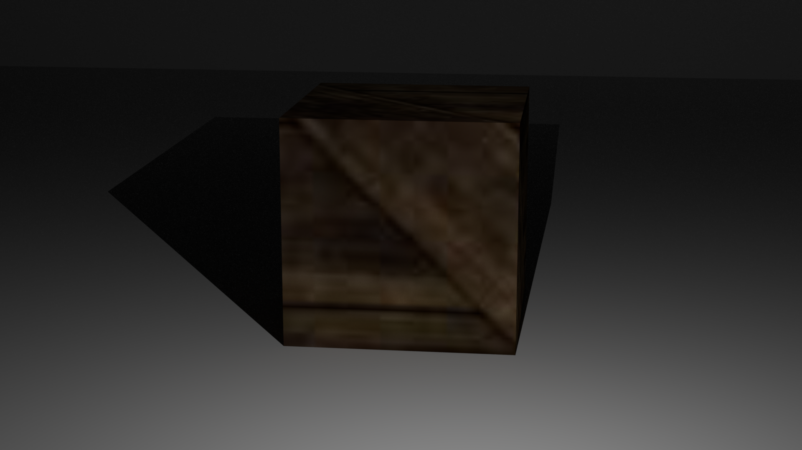 |
| Vertex color | yes | no | - |  | 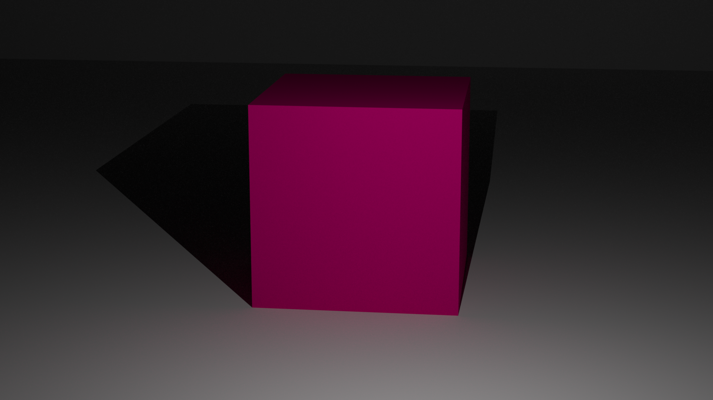 |
| Environment map | yes | yes | yes | 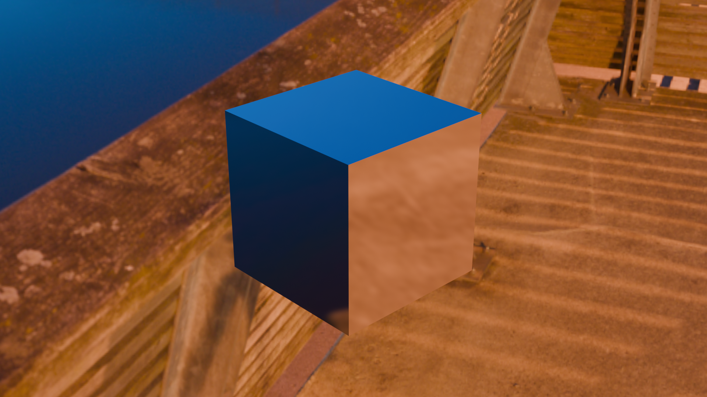 | 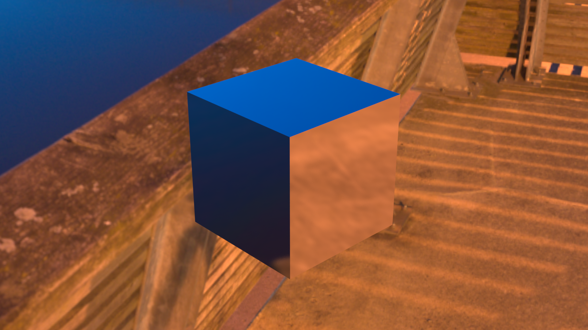 |

- Bug encountered when exporting volume scatter 
- Bug encountered when mitsuba tried rendering principled scene 

### How to test correctness of plugin
- Do we care about getting same renders as done inside of blender? YES
- Naive idea: Generate render in mitsuba using export of  predetermined blender tests scene, then compare result with reference (can be a previously rendered image of said scene). But how to compare the images? Question asked in previous semester project can go look into that. => **Not that interesting, would like to detect change on the blender side, want to compare blender and mitsuba renders directly with error factor**

### Current state of tests

- All tests run and pass if mitsuba-blender addon is not installed in blender (if it is installed, run_test.py crashes)
- Total coverage is 49%
- Most tests done on the importer, almost no test on the export
- Uses a z-test to compare between two mitsuba render (a reference and a new image generated from importing and exporting ref in and from blender)

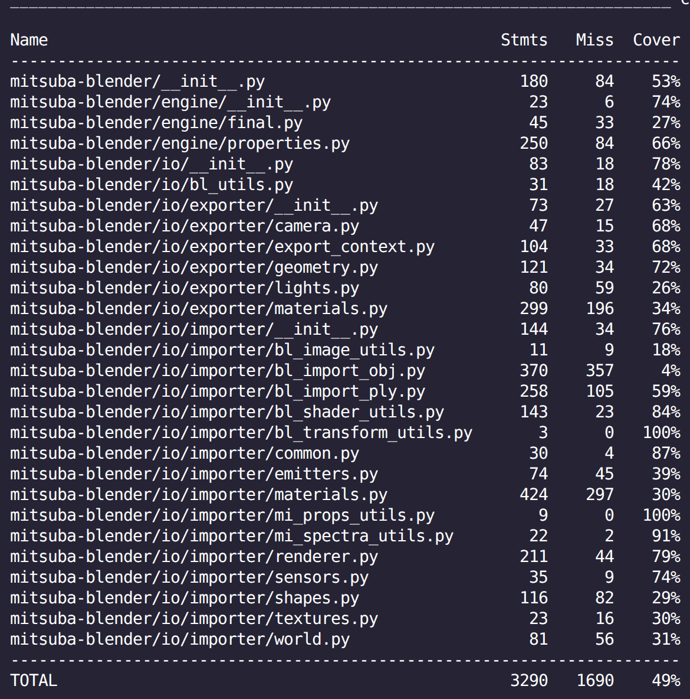

## TODO

- Get back and working test suit
- Redo tests with single max bounce
- Test with different roughness parameter
- Create list of difference between blender and mitsuba renders
- Try generating blender renders from file (if possible not from .obj) by script inside tests