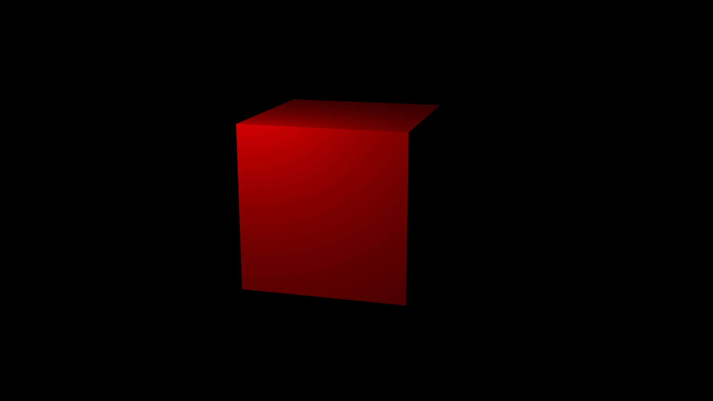
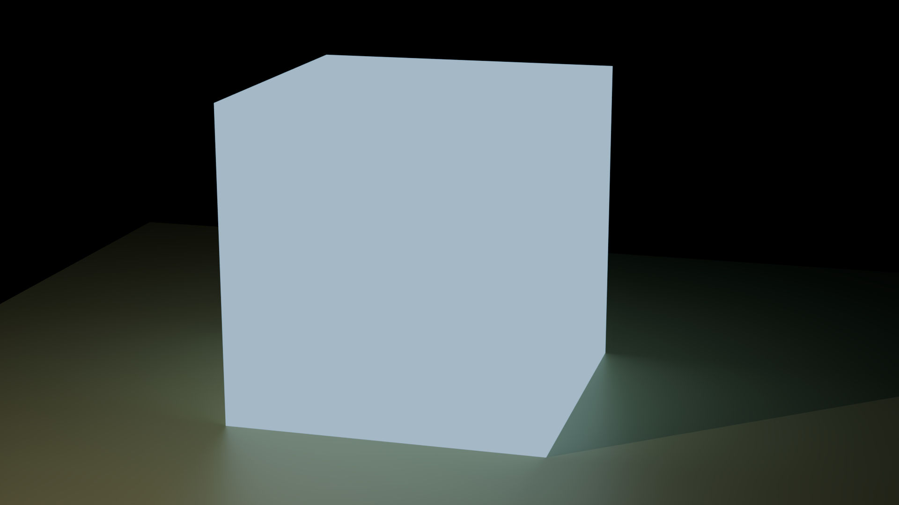
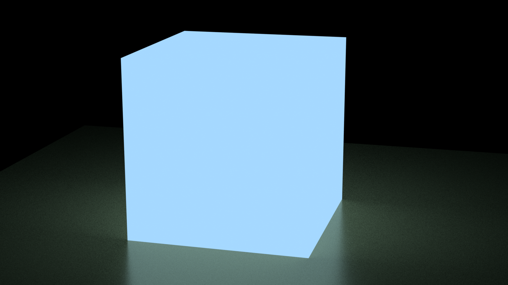
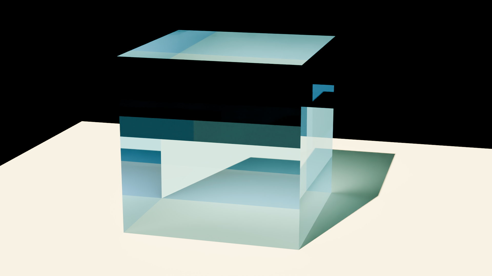
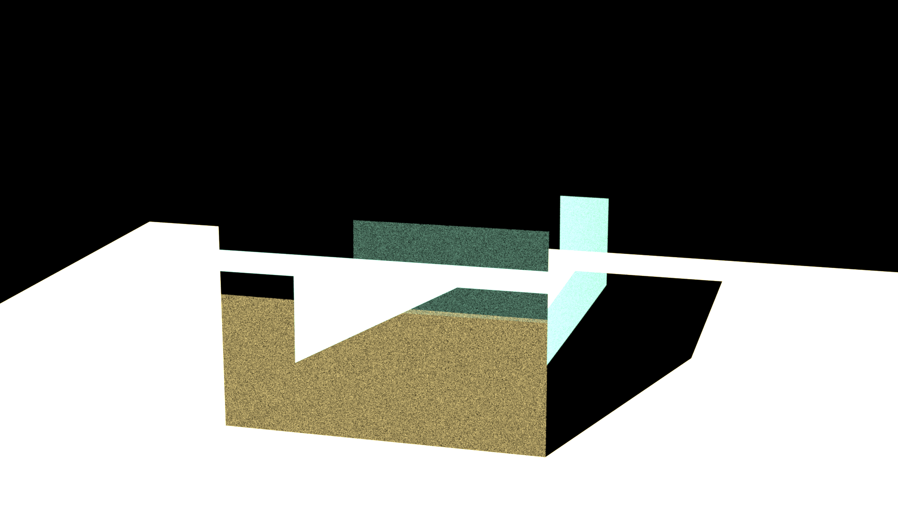

# Project journal and notes
## Current state of plugin

- On branch [mitsuba_version_update](https://github.com/mitsuba-renderer/mitsuba-blender/pull/137)
- Works with mitsuba 3.7 
- Internal rendering: not working at all (in blender lts 3 it raises unhandled error by invocating deprecated functions, in blender lts 4 the mitsubaRenderEngine class is simply incorect, was made for blender 3)
- Import: meshes seems to be correctly imported but materials are lost when trying to use mitsuba as render engine. Other engine keep some material but not all => requires more testing
- Export: meshes seems to be correctly exported to mitsuba, however light and material might not. Further testing is required.

### Export tests 
Blender scenes rendered with cycles using 64 samples and 5 bounces 
| shader node | export to mitsuba works | visually similar |
|-|-|-|
| Diffuse | yes | yes |
| Emission | yes | slight differences |
| Glass | yes? | noticeable differences |

#### Image comparison

 

